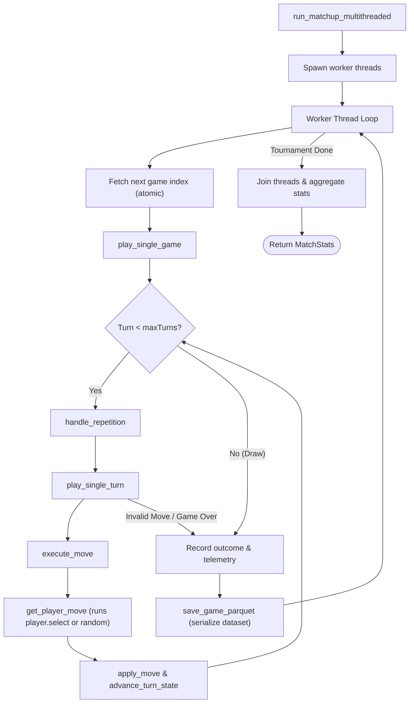

# Benchmarking and Matchmaking Framework

The benchmarking and matchmaking framework is implemented in [benchmark.hpp](../engine/include/kribu/benchmark.hpp) and executed by `benchmark_main.cpp`. It provides a multithreaded environment to run tournament matchups between different AI agents, collect telemetry and performance metrics, handle board state repetitions, and serialize results.

______________________________________________________________________

## Core Entities and Telemetry

The framework uses the following structures to define configuration, players, and match telemetry:

### 1. Match Configurations and Results

| Structure          | Purpose                                                    | Key Attributes                                                                                                                                                               |
| :----------------- | :--------------------------------------------------------- | :--------------------------------------------------------------------------------------------------------------------------------------------------------------------------- |
| `Player`           | Abstract representation of an AI player in the tournament. | `name` (string view), `select` (function pointer to select move), `madness` (random play injection probability).                                                             |
| `MatchConfig`      | Specifications of a scheduled matchup.                     | `player1Name`, `player2Name`, `games` (match count), `maxTurns` (limit per game).                                                                                            |
| `GameOutcome`      | Result of a single completed game.                         | `result` (P1/P2/Draw), `reason` (Elimination, Stalemate, Invalid Move, Max Turns, Repetition), `winMargin` (piece count difference), `forcedRandomTurns` (counter of loops). |
| `TournamentConfig` | Global parameters for executing matchups in parallel.      | `totalGames`, `maxTurns`, `threadCount`, and thread-safe atomics for tracking tournament progression and score.                                                              |

### 2. Performance Tracking

To record execution timing, the framework registers CPU time per player using high-resolution clocks:

- **`PlayerPerformance`**: Tracks `cpuTimeSeconds` accumulated by an agent during its decisions in a match.
- **`GamePerf`**: Bundles `PlayerPerformance` metrics for both players.
- **`MatchStats`**: Aggregates wins by type (e.g. `p1EliminationWins`, `p1StalemateWins`, `p2InvalidMoveWins`), total CPU time consumed by each player across all games, and total turns/plies.

______________________________________________________________________

## Execution and Matchmaking Loops

The diagram below details the matchmaking execution from a high level down to a single game turn:

### Turn Loop Functions

- **`play_single_game`**: Handles initial board state setup (`INITIAL_STATE`), turn-counter initialization, player starting order alternating by game index, and the loop execution.
- **`play_single_turn`**: Validates the game status before playing. If not ongoing, resolves game over logic. If ongoing, fetches and applies the move.
- **`execute_move`**: Calls `get_player_move` (which delegates to the player's select function) wrapped around high-resolution timing to populate telemetry. Swaps players/board states when a turn flips.

______________________________________________________________________

## Loop Prevention and Game Rules

To prevent infinite cycles where players repeat board positions, the framework implements a repetition checker:

1. **History Tracking**: The thread-local `currentGameHistory` vector stores Zobrist hashes of visited board states during a game.
1. **Detection**: `count_repetitions` scans the history to count occurrences of the current state's hash.
1. **Repetition Limits**:
   - If a repetition occurs 2 or more times, and repetition is allowed (`allowRepetition == true`), the system sets `forcedRandomTurnsLeft` to break the cycle.
   - The number of forced random turns scales quadratically:
     $$\\text{Forced Random Turns} = (\\text{repetitions} - 1)^2 \\times 2$$
   - If repetitions hit the global threshold (`maxRepetitions - 1`) and `allowRepetition == false`, a draw is declared with reason `WinReason::REPETITION`.
1. **Madness Mode**: Players can be configured with a non-zero `madness` percentage (0-100). If configured, there is a `madness` % probability on each turn that the player's choice is overridden by a random legal move.

______________________________________________________________________

## Data Export and Serialization

Every completed game's history is archived for offline analysis and machine learning training:

- **`TurnRecord`**: Stores the exact state before a move, whose turn it is, the chosen move ID, the list of all legal moves, and which agent (or forced random system) played the turn.
- **`save_game_parquet`**: Implemented using **Apache Arrow**, this function serializes the collection of `TurnRecord`s for a finished game directly to a Parquet file.
