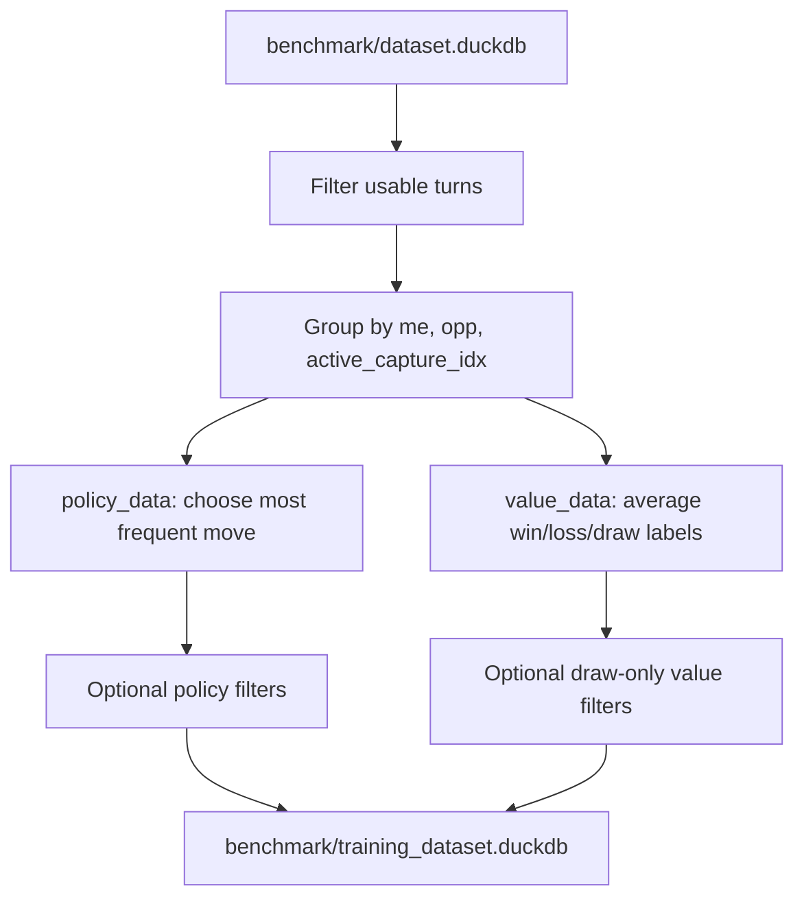

# Training Dataset Extraction

`make extract-data` builds the supervised training database used by the Python trainer from the raw benchmark database.

- Raw input: [../benchmark/dataset.duckdb](../benchmark/dataset.duckdb)
- Output: [../benchmark/training_dataset.duckdb](../benchmark/training_dataset.duckdb)
- Builder script: [../scripts/create_training_duckdb.py](../scripts/create_training_duckdb.py)
- Trainer loader: [../python/src/trainer/dataset.py](../python/src/trainer/dataset.py)

______________________________________________________________________

## Command

```bash
make extract-data
```

To pass options through `make`, place them after `--`:

```bash
make extract-data -- --min-policy-support 0.75 --max-draw-only-visits 8
```

This expands to:

```bash
PYTHONPATH=python/src uv run python scripts/create_training_duckdb.py ...
```

______________________________________________________________________

## What It Produces

The command writes two tables into `benchmark/training_dataset.duckdb`.

### `policy_data`

One row per exact state:

- `me`
- `opp`
- `active_capture_idx`
- `chosen_move`
- `visit_count`
- `distinct_move_count`
- `chosen_move_count`
- `move_support`

Meaning:

- Rows are grouped by exact board state.
- The most frequent move becomes the policy label.
- Extra columns preserve confidence information.

### `value_data`

One row per exact state:

- `me`
- `opp`
- `active_capture_idx`
- `value_label`
- `visit_count`
- `min_value_label`
- `max_value_label`
- `seen_draw_game`
- `seen_non_draw_game`

Meaning:

- Rows are grouped by exact board state.
- Win/loss/draw labels are averaged into `value_label`.
- Extra columns show whether the state is sharp, mixed, draw-only, or seen in both draw and non-draw games.

______________________________________________________________________

## Extraction Rules



### Policy extraction

Policy rows keep only turns where:

- game reason is not `INVALID_MOVE`
- game reason is not `DRAW_MAX_TURNS`
- acting player is not `MadPlayer`
- acting player type is `minimax` or `mcts`
- both players in the game are `minimax` or `mcts`

Why:

- `INVALID_MOVE` is bad supervision
- `DRAW_MAX_TURNS` can overrepresent loop-heavy move choices
- random/greedy opponents are useful for value shaping, but weak as policy teachers

### Value extraction

Value rows keep turns where:

- game reason is not `INVALID_MOVE`
- acting player is not `MadPlayer`
- acting player type is `minimax` or `mcts`

Labels:

- win from side-to-move perspective: `1.0`
- loss from side-to-move perspective: `0.0`
- draw: `0.5`

Why draws are kept:

- they teach the value head that some positions are neutral or unclear
- this is usually better than forcing every position into win/loss only

______________________________________________________________________

## Options

### `--min-policy-visits`

```bash
make extract-data -- --min-policy-visits 2
```

Drops policy states seen fewer than this many times.

Why:

- removes one-off labels
- reduces noise from rare states

Tradeoff:

- too high a value shrinks diversity

### `--min-policy-support`

```bash
make extract-data -- --min-policy-support 0.75
```

Drops policy states whose majority move support is below this fraction.

Example:

- state seen 4 times
- best move seen 3 times
- support is `3 / 4 = 0.75`

Why:

- filters ambiguous labels
- keeps states where the teacher agrees more strongly

Tradeoff:

- too high a value discards useful tactically rich positions where multiple moves are reasonable

### `--max-draw-only-visits`

```bash
make extract-data -- --max-draw-only-visits 8
```

Drops value states that are:

- seen only in `DRAW_MAX_TURNS` games
- labeled exactly `0.5`
- visited more than the chosen threshold

Why:

- trims loop-heavy draw states
- keeps normal draw supervision while reducing overrepresented repetition patterns

Set `0` to disable this filter.

______________________________________________________________________

## Recommended Presets

These presets are good first comparisons, not the only valid choices.

Use them as a small sweep:

1. build one unfiltered baseline
1. build one moderately cleaned dataset
1. optionally build one stricter policy dataset
1. train and compare validation metrics and arena strength

If one preset is clearly better, keep that one and adjust from there instead of trying many random combinations.

### Default

```bash
make extract-data
```

Use when:

- you want maximum data
- you want conservative behavior
- you are still exploring trainer settings

This is the baseline to compare everything else against.

### Cleaner policy, keep most value data

```bash
make extract-data -- --min-policy-support 0.75 --max-draw-only-visits 8
```

Use when:

- policy labels feel noisy
- you want to keep draw information
- you want fewer loop-heavy draw-only states

This is the most likely next step after the baseline.

### Stricter policy set

```bash
make extract-data -- --min-policy-visits 2 --min-policy-support 0.75 --max-draw-only-visits 8
```

Use when:

- you prefer fewer, cleaner policy rows
- benchmark volume is already large
- the baseline still looks too noisy

Use this only if the moderate preset helps or if policy supervision still looks unstable.

______________________________________________________________________

## Suggested Workflow

Start with three dataset builds and compare them:

### 1. Baseline

```bash
make extract-data
```

Why:

- tells you what the raw supervised signal can do
- gives a reference point for all later filtering

### 2. Moderate cleanup

```bash
make extract-data -- --min-policy-support 0.75 --max-draw-only-visits 8
```

Why:

- removes weaker policy labels
- trims the loopiest draw-only value states
- usually keeps most of the useful data

### 3. Strict policy cleanup

```bash
make extract-data -- --min-policy-visits 2 --min-policy-support 0.75 --max-draw-only-visits 8
```

Why:

- removes one-off policy labels
- keeps policy supervision cleaner when dataset size is already large

After that, compare:

- policy validation loss
- policy accuracy
- value validation loss or MAE
- arena strength against your reference bots

Pick the simplest preset that improves real play, not just training curves.

______________________________________________________________________

## How To Adjust After The First Sweep

If baseline is best:

- keep the unfiltered dataset
- spend effort on better benchmark games instead of stronger filtering

If moderate cleanup is best:

- keep `--min-policy-support 0.75`
- then optionally test nearby values like `0.70` or `0.80`

If strict cleanup is best:

- keep `--min-policy-visits 2`
- only increase further if the dataset remains very large and policy still looks noisy

Avoid changing many knobs at once. Change one thing, retrain, and compare.

______________________________________________________________________

## Why Not Use Plain `DISTINCT`

Plain `DISTINCT` throws away confidence.

Example:

- one state appears `20` times with the same move
- another appears `1` time with the same move

With plain dedup, both become one row and look equally strong.

This extractor keeps support columns so you can:

- filter weak labels
- inspect confidence
- later add weighting if needed

______________________________________________________________________

## How To Inspect The Result

Show tables:

```bash
duckdb benchmark/training_dataset.duckdb -c ".tables"
```

Inspect schemas:

```bash
duckdb benchmark/training_dataset.duckdb -c "DESCRIBE policy_data; DESCRIBE value_data;"
```

Quick row counts:

```bash
duckdb benchmark/training_dataset.duckdb -c "SELECT COUNT(*) FROM policy_data; SELECT COUNT(*) FROM value_data;"
```

Check support distribution:

```bash
duckdb benchmark/training_dataset.duckdb -c "SELECT ROUND(move_support, 2) AS support, COUNT(*) FROM policy_data GROUP BY support ORDER BY support;"
```

______________________________________________________________________

## How It Fits Training

The trainer reads both tables with `SELECT *` and uses only the required label columns plus board-state columns from [../python/src/trainer/dataset.py](../python/src/trainer/dataset.py).

That means:

- adding support metadata does not break training
- the extra columns remain available for analysis and future filtering

______________________________________________________________________

## Practical Guidance

- Add more strong-vs-strong benchmark games before tightening filters too much.
- Prefer `--min-policy-support` before aggressive `--min-policy-visits`.
- Keep draw data for value unless you have a clear reason to train a win/loss-only evaluator.
- Use `--max-draw-only-visits` to trim repetitive draw loops without deleting all draw supervision.
