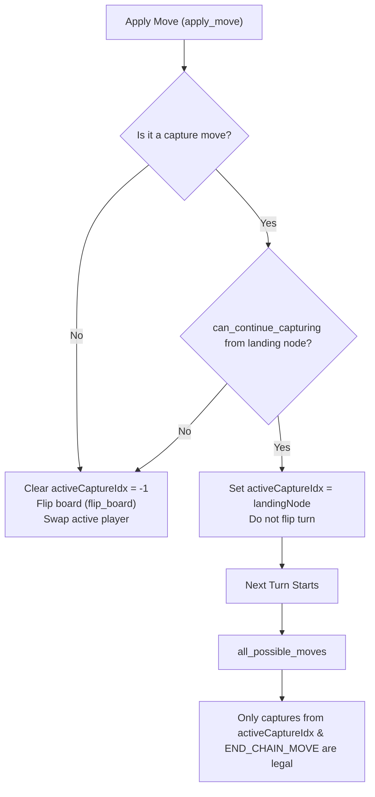

# Sholo Guti Rules Engine and Topology

The rule engine, board representation, and topology are defined in [board.hpp](../engine/include/kribu/board.hpp) and [rules.hpp](../engine/include/kribu/rules.hpp). It uses coordinate-free bitboard representations, compile-time topology generation, and fast bitwise check systems to validate moves and determine game outcomes.

______________________________________________________________________

## Board Representation (Bitboards)

The Sholo Guti board consists of 37 nodes structured in a grid pattern. Instead of using raw arrays, the engine uses **bitboards** inside the `boardState` structure for high-efficiency operations:

```cpp
struct boardState {
  u64 me = 0;              // Active player's pieces (bits 0-36)
  u64 opp = 0;             // Opponent's pieces (bits 0-36)
  i8 activeCaptureIdx = -1;// Capturing piece node index locked in multi-capture chain
  u64 hash = 0;            // Incremental Zobrist hash key
};
```

- **Piece Masks**: Each player has up to 16 pieces represented as set bits in a 64-bit integer mask.
- **Initial Layout (`INITIAL_STATE`)**:
  - Opponent pieces occupy nodes 0 to 15 (lower rows, bits 0-15 set: `0x0000'0000'0000'FFFFULL`).
  - Active player pieces occupy nodes 21 to 36 (upper rows, bits 21-36 set: `0x0000'001F'FFE0'0000ULL`).
  - Center row (nodes 16 to 20, bits 16-20) starts completely empty.
- **Bitboard Operations**:
  - Counting pieces (`piece_count`) uses fast hardware population counting (`std::popcount` at compile-time or `eve::popcount` at runtime).
  - Checking node occupancy is done via bit-shifting and masking: `(occupied >> nodeIndex) & 1U`.

______________________________________________________________________

## Graph Topology and Compile-Time Metadata

The Sholo Guti board is represented as an unweighted graph of 37 vertices. Adjacency lists and move indices are resolved at compile time to eliminate runtime lookup overhead.

1. **`MOVE_TABLE`**: A static array of all potential physical move transitions (`move`). Each transition defines a starting node (`from`), target destination node (`to`), and the hopped-over captured node (`captured` or `-1` for quiet slides).
1. **Move Sorting Hierarchy**:
   - `generate_validated_move_table` sorts the move array lexicographically at compile time.
   - End-chain sentinels (`from == -1`) come first, followed by simple sliding moves, then jump captures.
1. **`BOARD_METADATA`**:
   - `neighbors`: Adjacency lists for each node.
   - `counts`: Count of neighbors for each node.
   - `moveIdMap`: Two-dimensional array lookup `[from][to]` returning the unique move ID or `-1`.
   - `maxMovesPerState`: Sum of the top 16 nodes' possible move counts (calculated as `37` at compile-time), defining the exact stack-allocation capacity limit for `MoveList` arrays.

______________________________________________________________________

## Multi-Capture Chains

A core rule of Sholo Guti is the multi-capture chain. If a player captures an opponent piece, and the landing node permits further jumps, the player may continue capturing.



- **`activeCaptureIdx`**: Stores the index of the capturing piece. If it is $\\ne -1$, only capture moves originating from this node are legal.
- **`END_CHAIN_MOVE`**: A special sentinel move ID (`0`). If a capture chain is active, a player can play this sentinel to stop capturing and end their turn.
- **`can_continue_capturing`**: Scans all compile-time capture moves starting at the landing node, verifying that the target destination node is empty and the jumped-over node contains an opponent piece.

______________________________________________________________________

## Validation & Perspective Flipping

### 1. Board Flipping (`flip_board`)

Since players have different starting rows, the engine simplifies move generation and evaluation by always evaluating from the active player's perspective.

- At the end of a turn (or when evaluating opponent responses), `flip_board` is called.
- It performs a symmetrical 180-degree flip mapping `0 -> 36`, `1 -> 35`, etc.
- The active player's and opponent's piece bitmasks are swapped.
- Trailing zero bitwise functions (`std::countr_zero`) and Brian Kernighan's bit-clearing algorithm (`bits & (bits - 1)`) are used to process set bits rapidly.

### 2. Move Validation (`is_valid`)

Verifies the legality of a move:

- Verifies starting-piece ownership: `(me >> mov.from) & 1U != 0`.
- Verifies destination vacancy: `((me | opp) >> mov.to) & 1U == 0`.
- Verifies capture legality: `(opp >> mov.captured) & 1U != 0`.
- Enforces active capture chain constraints if `activeCaptureIdx != -1`.

### 3. Game Over Detection (`get_game_status`)

Evaluates the board state to check for:

- **Elimination**: If `piece_count(opp) == 0`, active player wins. If `piece_count(me) == 0`, opponent wins.
- **Stalemate**: If the active player has no legal moves (`all_possible_moves(state).empty()`), they lose. If the opponent has no legal moves on the flipped board, the active player wins.
