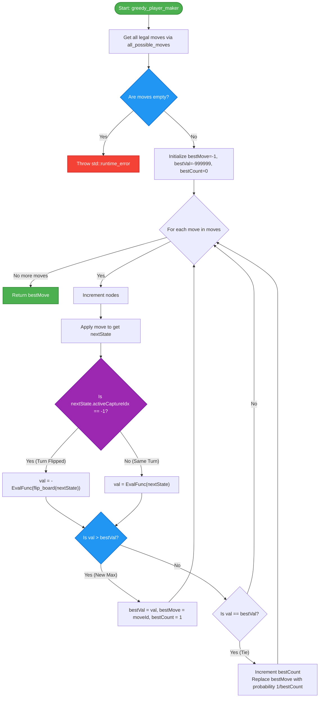

# Greedy Player

The **Greedy Player** is a 1-step lookahead agent that evaluates all legal moves immediately available and chooses the one that results in the highest board evaluation.

## Overview

The greedy player is implemented in \[greedy.hpp\](file:///home/hz/file/git/kribu/engine/include/kribu/player/greedy.hpp). It is parameterized by a template evaluation function `EvalFunc`, allowing it to be instantiated with different evaluation metrics (e.g., piece count or node values).

## Algorithm Details

### `greedy_player_maker`

```cpp
template <auto EvalFunc>
int greedy_player_maker(const boardState& state, u64& nodes)
```

The function executes the following process:

1. Generates all possible legal moves using `all_possible_moves(state)`. If no moves are available, it throws a `std::runtime_error`.
1. Initializes tracking variables:
   - `bestMove = -1`
   - `bestVal = -999999`
   - `bestCount = 0` (used for tie-breaking)
1. For each candidate move:
   - Increments the `nodes` counter.
   - Applies the move to get `nextState`.
   - Determines the evaluation perspective:
     - **Turn Flipped**: If the move ends the current turn (`nextState.activeCaptureIdx == -1`), the board is flipped to the opponent's perspective. The evaluation is negated: `val = -EvalFunc(flip_board(nextState))`.
     - **Same Turn (Capture Chain)**: If the player can continue capturing (`nextState.activeCaptureIdx != -1`), the turn does not flip. The evaluation is kept positive: `val = EvalFunc(nextState)`.
   - Compares the evaluation:
     - If `val > bestVal`, updates `bestVal`, sets `bestMove` to the current move, and resets `bestCount = 1`.
     - If `val == bestVal`, increments `bestCount` and performs reservoir sampling: replaces `bestMove` with the current move with a probability of `1 / bestCount` (`(rng() % bestCount) == 0`).
1. Returns the `bestMove`.

> [!TIP]
> **Reservoir Sampling** ensures that if multiple moves yield the exact same maximum evaluation, one is selected uniformly at random without requiring a secondary array to store the tied moves.

______________________________________________________________________

## Control Flow

Below is the control flow of the greedy player:


