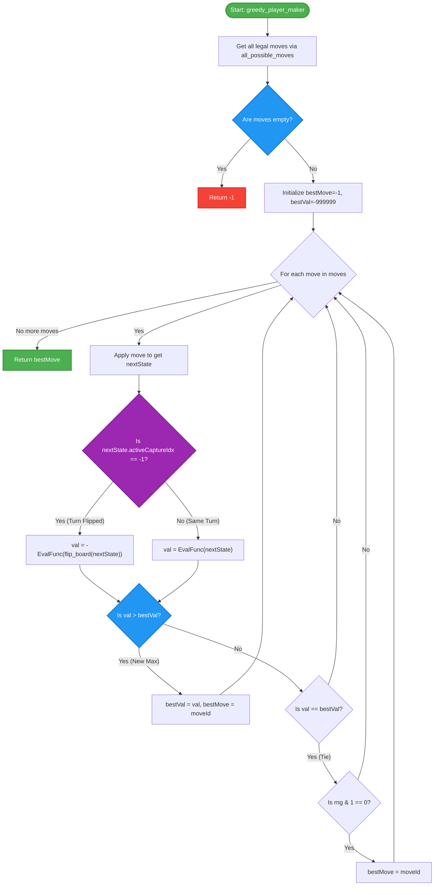

# Greedy Player

The **Greedy Player** is a 1-step lookahead agent that evaluates all legal moves immediately available and chooses the one that results in the highest board evaluation.

## Overview

The greedy player is implemented in [greedy.hpp](../engine/include/kribu/player/greedy.hpp). It utilizes the standard evaluation heuristic `kribu::heuristics::evaluate` at a fixed depth of 3 to select moves.

______________________________________________________________________

## Algorithm Details

### `greedy_player_maker`

```cpp
int greedy_player_maker(const boardState& state)
```

The function executes the following process:

1. Generates all possible legal moves using `all_possible_moves(state)`. If no moves are available, it returns `-1`.
1. Initializes tracking variables:
   - `bestMove = -1`
   - `bestVal = -999999`
1. For each candidate move:
   - Applies the move to get `nextState`.
   - Determines the evaluation perspective:
     - **Turn Flipped**: If the move ends the current turn (`nextState.activeCaptureIdx == -1`), the board is flipped to the opponent's perspective. The evaluation is negated: `val = -heuristics::evaluate(flip_board(nextState), 3)`.
     - **Same Turn (Capture Chain)**: If the player can continue capturing (`nextState.activeCaptureIdx != -1`), the turn does not flip. The evaluation is kept positive: `val = heuristics::evaluate(nextState, 3)`.
   - Compares the evaluation:
     - If `val > bestVal`, updates `bestVal` and sets `bestMove` to the current move.
     - If `val == bestVal`, tie-breaking occurs: there is a 50% probability (`(rng() & 1) == 0`) that the current move replaces `bestMove`.
1. Returns the `bestMove`.

> [!TIP]
> **50/50 Tie-breaking** ensures that if multiple moves yield the exact same maximum evaluation, the agent selects one randomly, providing game variability without search overhead.

______________________________________________________________________

## Control Flow

Below is the control flow of the greedy player:


