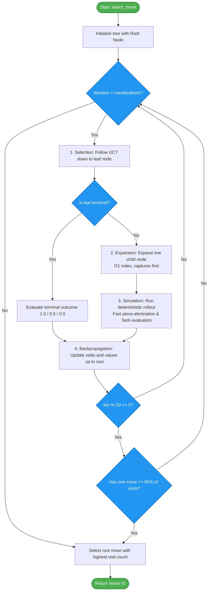

# Monte Carlo Tree Search (MCTS) Player

The **MCTS Player** is a simulation-based agent that uses Monte Carlo Tree Search (MCTS). It builds a decision tree dynamically by running random or heuristic playout simulations to estimate the win probability of moves.

## Overview

The MCTS player is implemented in [mcts.hpp](../engine/include/kribu/player/mcts.hpp). It extends the standard Upper Confidence Bound for Trees (UCT) formula with several heuristic and performance optimizations to make it highly competitive in Sholo Guti.

______________________________________________________________________

## The 4-Phase MCTS Cycle

Each iteration of the MCTS engine runs through four distinct phases:

### 1. Selection

Starting at the root node, the engine traverses down the tree by selecting the child node that maximizes the UCT formula. The traversal stops when it reaches a node that is not fully expanded or is terminal.

The UCT formula is enhanced with **Progressive Bias** and **First Play Urgency (FPU)**:

- **Visited Children**:
  $$\\text{UCT} = \\text{childWinRate} + C \\times \\sqrt{\\frac{\\ln(\\text{parentVisits})}{\\text{childVisits}}} + \\frac{\\text{prior} \\times \\text{BIAS_WEIGHT}}{\\text{childVisits} + 1}$$
  where $C = \\sqrt{2}$ and `prior` is the heuristic evaluation of the board state normalized to $[0, 1]$.
- **Unvisited Children (First Play Urgency)**:
  Instead of forcing a round-robin exploration of every single child, unvisited children receive an initial score:
  $$\\text{UCT} = \\text{parentWinRate} - \\text{FPU_REDUCTION} + (\\text{prior} \\times \\text{BIAS_WEIGHT})$$
  This allows the tree policy to ignore clearly bad moves and focus exploration on promising paths immediately.

### 2. Expansion

If the selected leaf node is not terminal, the engine expands a new child node:

- **O(1) Expansion**: The node tracks `nextExpandIdx` to determine which legal move to expand next. This eliminates the need to scan existing children, ensuring constant-time node expansion.
- **Capture Priority**: Moves are generated and ordered such that capture moves are expanded before quiet moves.

### 3. Simulation (Rollout)

A simulation playout is run from the expanded node's state until a game outcome is reached or the step limit is exceeded.

- **Deterministic Reply-Aware Policy**: In each step, the rollout policy chooses the best move using `Rollout::select_move()`. This policy ranks candidate moves using static evaluation and runs lookahead checks to find the opponent's best immediate response, preventing the rollout from choosing moves with devastating replies.
- **Fast Terminal Check**: To maximize simulation speed, rollouts skip expensive stalemate detection and check only for piece elimination (`piece_count == 0`).
- **Tanh Normalization**: If the step limit (60 steps) is reached, the static evaluation of the final state is mapped to a $[0, 1]$ win probability using a hyperbolic tangent function:
  $$\\text{Value} = 0.5 + 0.5 \\times \\tanh\\left(\\frac{\\text{Heuristic Score}}{3000.0}\\right)$$

### 4. Backpropagation

The result of the simulation ($1.0$ for win, $0.5$ for draw, $0.0$ for loss) is propagated back up the path to the root. The win rate of parent nodes is inverted appropriately whenever the player turn flips between a parent and its child.

______________________________________________________________________

## Parallelism & Termination Optimizations

MCTS runs as a single-threaded search algorithm. However, the benchmarking tournament executes multiple independent games in parallel using worker threads.

### Early Termination

After every 50 iterations, the root node checks if the most visited child has accumulated $\\ge 85%$ of the total visits (`MCTS_EARLY_TERM_THRESHOLD`). If so, the search terminates early, saving significant computational resources.

______________________________________________________________________

## Control Flow & Architecture

Below is the control flow of the MCTS decision cycle:

