# Minimax Player

The **Minimax Player** is a highly optimized search-based agent that uses the minimax algorithm with alpha-beta pruning. It is enhanced with modern game-tree search techniques to search deeper and more efficiently.

## Overview

The minimax player is implemented in \[minimax.hpp\](file:///home/hz/file/git/kribu/engine/include/kribu/player/minimax.hpp). It supports templates for custom evaluation functions and is configured with optimizations that match modern chess/checkers engines.

______________________________________________________________________

## Core Optimizations

The minimax engine implements the following search enhancements:

### 1. Lazy SMP Parallelism

When configured with multiple threads (`NumThreads > 1`), the player uses **Lazy SMP (Symmetric Multi-Processing)**.

- It spawns multiple threads, all performing independent search iterations on the same root position.
- They share a single global **Transposition Table (TT)**.
- Threads naturally diversify because they read and write to the shared TT at slightly different times, exploring different branches.
- Odd-indexed threads search slightly different target depths ($\\pm 1$) to further diversify the search.
- The best move found across all threads is returned.

### 2. Iterative Deepening & Aspiration Windows

Instead of searching directly to the target depth, the engine searches incrementally from depth $1, 2, \\dots, D$.

- **Transposition Table Warmup**: Shallower searches populate the TT, ensuring that deeper searches start with highly accurate move ordering.
- **Aspiration Windows**: For depth $d \\ge 3$, the engine restricts the alpha-beta search window to $[prevScore - 50, prevScore + 50]$ using the score from depth $d-1$. If the score fails outside this window (fails low/high), the search is repeated with a full window. This saves search time by pruning branches outside the expected score range.

### 3. Move Ordering

Move ordering is critical for alpha-beta efficiency. Moves at each node are prioritized using `order_moves` in the following sequence:

1. **Transposition Table Move**: The best move stored from a previous search of this position.
1. **Captures**: Winning/tactical moves.
1. **Killer Moves**: Quiet moves that caused a beta cutoff at the current depth in other branches (stored in a thread-local `KillerTable` tracking 2 slots per depth).
1. **Quiet Moves**: Remaining moves.

### 4. Principal Variation Search (PVS)

PVS assumes the first ordered move (the Principal Variation) is likely the best.

- The first move is searched with a full window $[\\alpha, \\beta]$.
- Subsequent moves are searched with a **null (zero) window** $[\\alpha, \\alpha + 1]$ (or $[-\\alpha-1, -\\alpha]$ depending on turn flips) to quickly check if they are better than the PV.
- Only if a scout search fails high (score $> \\alpha$) is the move re-searched with a full window.

### 5. Null-Move Pruning (NMP)

If the player can "pass" the turn (null move) and the opponent still cannot obtain a score $\\ge \\beta$ at a reduced depth ($depth - 1 - 2$), the engine assumes the position is strong enough to cause a beta cutoff, and prunes the node.

- **Zugzwang Prevention**: Disabled if the active player has $< 4$ pieces.
- **Capture Chains**: Disabled mid-capture chain.

### 6. Late Move Reductions (LMR)

Quiet moves ordered late in the list (move index $\\ge 3$) are unlikely to be the best.

- They are searched at a reduced depth (reduced by 1, or by 2 if depth $\\ge 6$ and move index $\\ge 6$).
- If the reduced search yields a score $> \\alpha$, it is re-searched at full depth.

### 7. Quiescence Search (Q-Search)

To avoid the **horizon effect** (where a player blunders because a bad capture sequence starts just beyond the search depth limit), leaf nodes ($depth \\le 0$) transition to a quiescence search.

- Only captures and turn-ending moves (`END_CHAIN_MOVE`) are evaluated.
- Uses "stand-pat" evaluation (the static evaluation of the current board state) as a lower bound.

______________________________________________________________________

## Recursive Search Control Flow

The flowchart below outlines the recursive `alpha_beta` search algorithm and its `evaluate_children` helper:

```mermaid
flowchart TD
    Start(["alpha_beta state, depth, alpha, beta, isRoot"]) --> TerminalCheck{"Is Terminal?<br/>Repetitions (if !isRoot) / 0 pieces"}
    TerminalCheck -- Yes --> ReturnTerminal[Return Win/Loss/Draw score]

    TerminalCheck -- No --> LeafCheck{"Is depth <= 0?"}
    LeafCheck -- Yes --> QSearch[Run quiescence_search]

    LeafCheck -- No --> TTOProbe{"TT Probe Match?"}
    TTOProbe -- Yes --> RootTTCheck{"IsRoot & moveId == -1?"}
    RootTTCheck -- No --> ReturnTT[Return TT Score & Move]
    RootTTCheck -- Yes --> NMPCheck

    TTOProbe -- No --> NMPCheck{"Null Move Pruning?<br/>!isRoot & depth >= 3 & pieces >= 4"}
    NMPCheck -- Yes --> NullSearch[Pass turn, search at reduced depth]
    NullSearch --> NullCutoff{"Score >= beta?"}
    NullCutoff -- Yes --> ReturnBeta[Return beta cutoff]
    NullCutoff -- No --> OrderMoves
    NMPCheck -- No --> OrderMoves

    OrderMoves["Order moves: TT -> Captures -> Killers -> Quiets"] --> EvalChildren[evaluate_children]

    EvalChildren --> LoopStart{"For each move i"}

    LoopStart -- No more moves / cutoff --> StoreTT[Store result in TT]
    StoreTT --> ReturnBest["Return bestScore & bestMoveId"]

    LoopStart -- Yes --> LMRCheck{"Apply LMR?<br/>i >= 3, quiet move, depth >= 3"}
    LMRCheck -- Yes --> SearchReduced[Search child at reduced depth]
    LMRCheck -- No --> SearchPVS[Search child via PVS]

    SearchReduced --> LMRCutoff{"Score > alpha?"}
    LMRCutoff -- Yes --> SearchPVS
    LMRCutoff -- No --> UpdateStats

    SearchPVS --> UpdateStats

    UpdateStats{"Is score > bestScore?"}
    UpdateStats -- Yes --> SetBest["bestScore = score, bestMoveId = moveId, alpha = max alpha, score"]
    UpdateStats -- No --> CutoffCheck
    SetBest --> CutoffCheck

    CutoffCheck{"alpha >= beta?"}
    CutoffCheck -- Yes --> StoreKiller[If quiet, store as Killer Move]
    StoreKiller --> StoreTT
    CutoffCheck -- No --> LoopStart

    style Start fill:#4CAF50,stroke:#388E3C,stroke-width:2px,color:#fff
    style TerminalCheck fill:#2196F3,stroke:#1976D2,stroke-width:2px,color:#fff
    style LeafCheck fill:#2196F3,stroke:#1976D2,stroke-width:2px,color:#fff
    style TTOProbe fill:#2196F3,stroke:#1976D2,stroke-width:2px,color:#fff
    style NMPCheck fill:#2196F3,stroke:#1976D2,stroke-width:2px,color:#fff
    style EvalChildren fill:#FF9800,stroke:#F57C00,stroke-width:2px,color:#fff
    style CutoffCheck fill:#9C27B0,stroke:#7B1FA2,stroke-width:2px,color:#fff
    style ReturnBest fill:#4CAF50,stroke:#388E3C,stroke-width:2px,color:#fff
```

