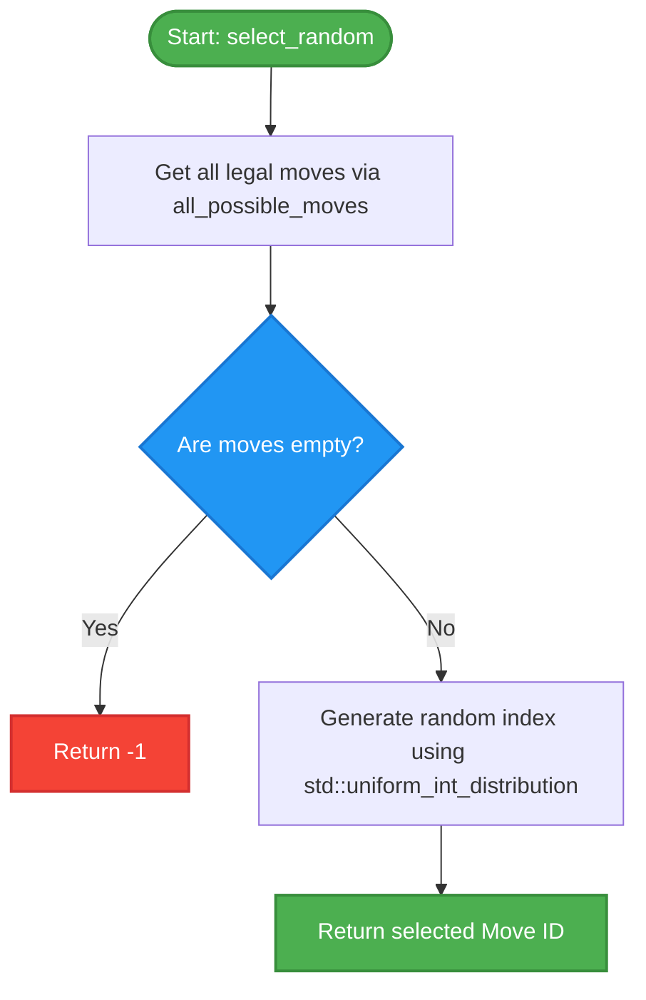

# Random Player

The **Random Player** is a baseline agent for the Sholo Guti engine. It makes moves purely at random without any lookahead or heuristic evaluation. It serves as a control baseline for benchmarking more sophisticated search-based and simulation-based players.

## Overview

The random player is implemented in [random.hpp](../engine/include/kribu/player/random.hpp). It uses a thread-local fast pseudo-random number generator (`rng` from [fast_rng.hpp](../engine/include/kribu/fast_rng.hpp)) to select a move uniformly at random from the list of all legally available moves.

______________________________________________________________________

## Algorithm Details

### `select_random`

```cpp
inline int select_random(const boardState& state)
```

The function performs the following steps:

1. Computes the list of all legal moves for the current state using `all_possible_moves(state)`.
1. If no legal moves are available (stalemate/loss), it returns `-1`.
1. Otherwise, it uses `std::uniform_int_distribution` to generate a random index within the move list bounds and returns the move ID at that index.

______________________________________________________________________

## Control Flow

Below is the control flow of the random player's decision-making process:


